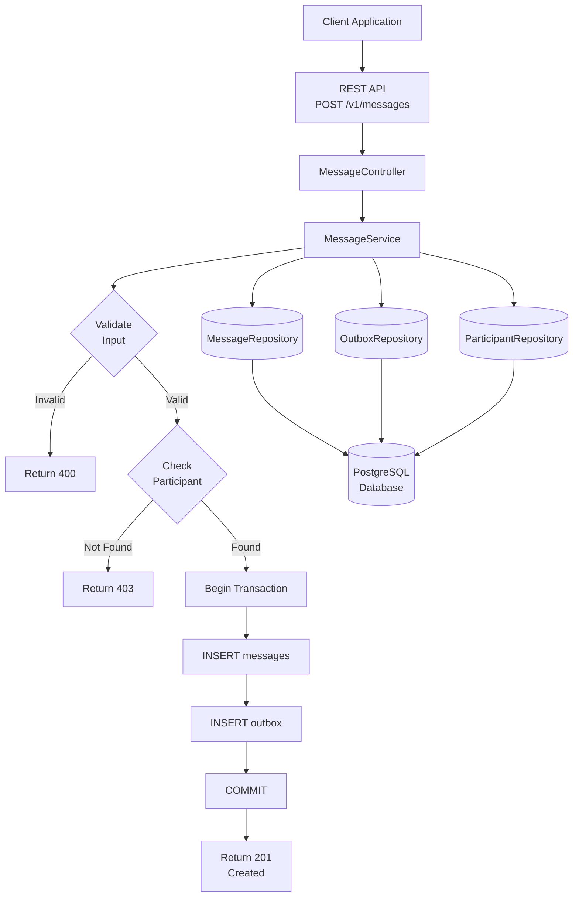
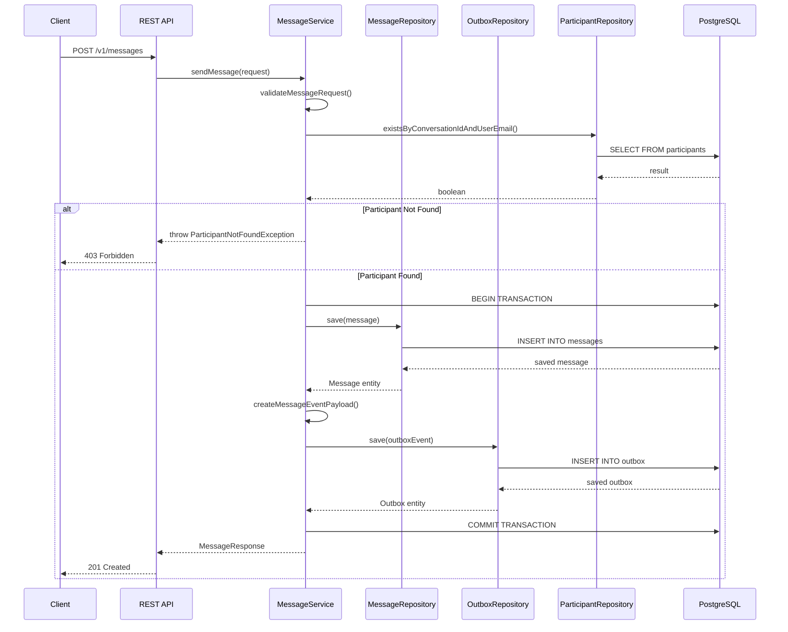
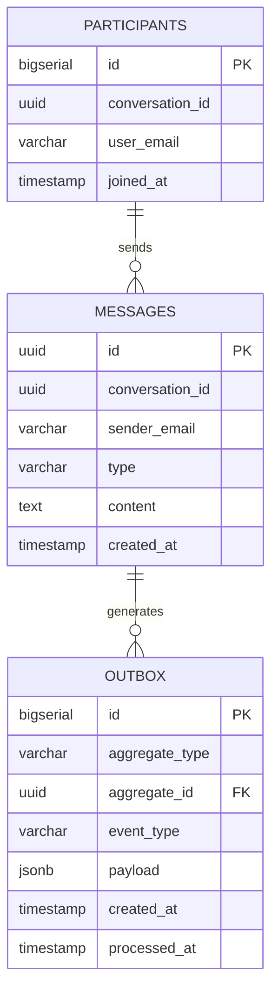
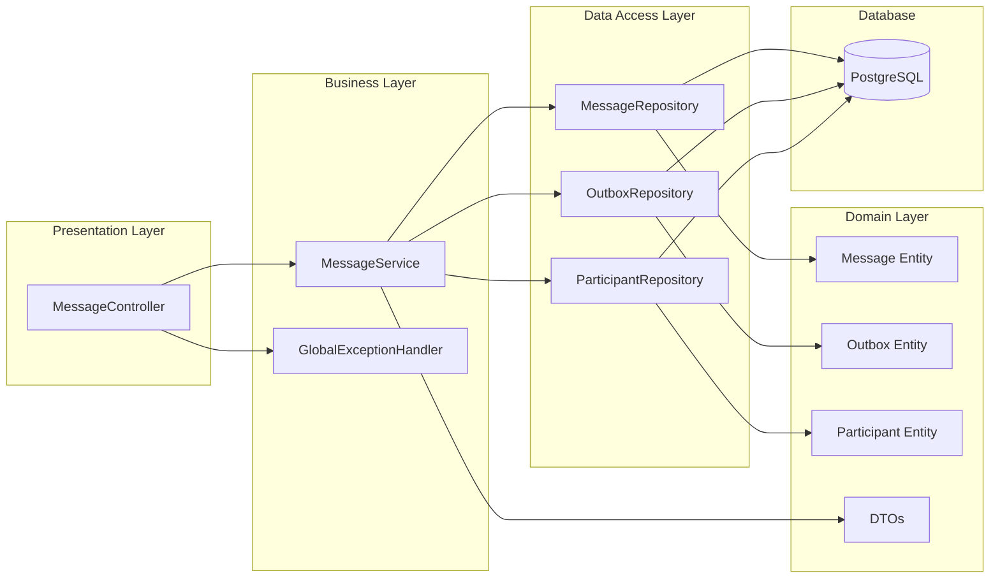
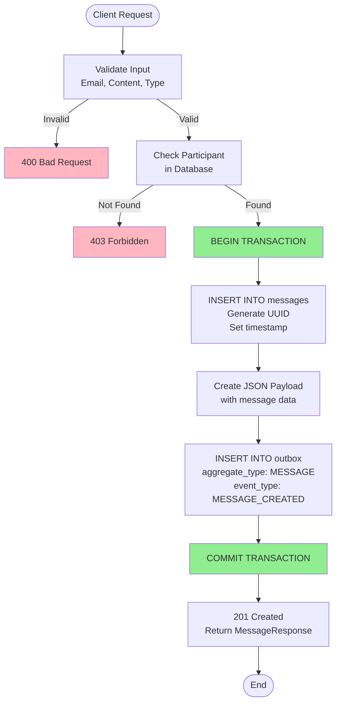
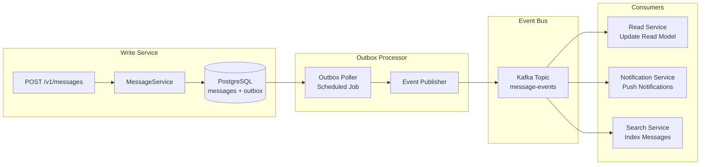

# Chat Write Service - Architecture Diagrams

## 1. High-Level Architecture

## 2. Transactional Outbox Pattern Flow

## 3. Database Schema

## 4. Component Diagram

## 5. Data Flow - Successful Message Send

## 6. Event Processing (Future Implementation)

## Key Design Decisions

### 1. Transactional Outbox Pattern
- **Problem**: Đảm bảo tính nhất quán giữa database write và event publish
- **Solution**: Lưu event vào cùng database transaction với message
- **Benefit**: Atomic operation, không mất event, eventual consistency

### 2. UUID for Message ID
- **Why**: 
  - Distributed system friendly
  - No central ID generator needed
  - Time-sortable (UUID v7) or random (UUID v4)

### 3. Email as User Identifier
- **Why**: 
  - Integration với CRM system
  - Human-readable
  - Unique identifier

### 4. Separate Participant Table
- **Why**:
  - Efficient permission check
  - Support multi-user conversations
  - Easy to query and index

### 5. JSONB for Event Payload
- **Why**:
  - Flexible schema
  - Native PostgreSQL support
  - Queryable with JSON operators
  - Easy to evolve event structure
